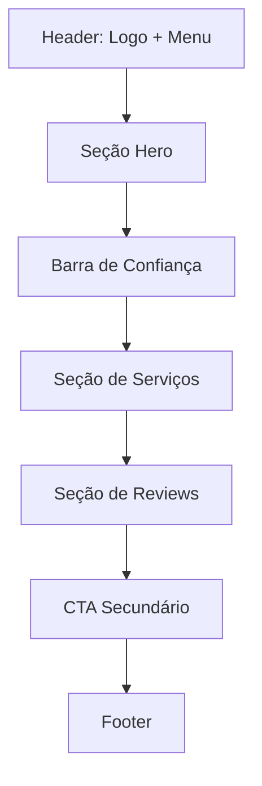

# Wireframe Completo - Fix Serviços (Mobile)

Este wireframe detalha a estrutura completa da página inicial da Fix Serviços, incorporando todas as melhorias de UX/UI e CRO discutidas, com foco na conversão via WhatsApp para usuários mobile.

## Detalhamento das Seções:

### 1. Header
*   **Elementos:** Logo "Fix Serviços" (canto superior esquerdo), Ícone de Menu (canto superior direito).
*   **Função:** Navegação principal e identidade da marca.

### 2. Seção Hero (Dobra Inicial)
*   **Background:** Imagem do técnico com overlay escurecido/gradiente para legibilidade.
*   **Tag:** `SERVIÇOS DE QUALIDADE` (verde, fonte menor, contraste otimizado).
*   **Título (H1):** `Marido de Aluguel em Blumenau` (preto, negrito, com "Blumenau" em verde).
*   **Descrição:** `Eletricista, encanador e reparos gerais com padrão de qualidade superior. Atendimento rápido para sua casa ou empresa.` (cinza `#444444`, `line-height: 1.6`).
*   **Botão CTA Principal:** `Solicitar Orçamento` (verde vibrante, `py-6`, `shadow-[0_8px_24px_rgba(0,0,0,0.1)]`, com ícone de seta para a direita).
*   **Micro-copy:** `Resposta média em 5 minutos` (verde, fonte menor).
*   **Alinhamento:** Todos os elementos de texto e botão alinhados à esquerda, com espaçamento vertical otimizado (`mb-8` após título, `mb-32px` após descrição).

### 3. Barra de Confiança
*   **Conteúdo:** `MAIS DE 15.000 RESIDÊNCIAS ATENDIDAS` (com ícone de check/estrela).
*   **Estilo:** Faixa horizontal com fundo escuro (ex: `#1a202c`) e texto em branco/verde claro.
*   **Função:** Reforçar a credibilidade e experiência logo após a primeira dobra.

### 4. Seção de Serviços
*   **Título (H2):** `Tudo o que você precisa em reparos e instalações` (preto, negrito, com "reparos e instalações" em verde).
*   **Descrição:** `Especialistas em resolver problemas do dia a dia com agilidade em toda Blumenau.`
*   **Cards de Serviço:**
    *   Cada card contém: Ícone do serviço (Eletricista, Encanador, Marido de Aluguel, Casa Inteligente), Título do Serviço, Breve Descrição.
    *   **Interatividade:** Cada card deve ser clicável, levando a uma página de detalhes do serviço ou abrindo o WhatsApp com uma mensagem pré-preenchida.

### 5. Seção de Reviews (Prova Social)
*   **Título (H2):** `O que dizem nossos clientes em Blumenau.` (fundo escuro, texto branco, com "Blumenau" em verde).
*   **Descrição:** `A satisfação de quem já utilizou nossos serviços é a nossa maior garantia. Atendemos com transparência e respeito em cada residência que entramos.`
*   **Pontos de Confiança:** Lista de itens como `Média 5 estrelas no Google` (com logo do Google), `Referência em reparos e limpeza na cidade`, `Garantia estendida em todos os serviços` (com ícones de check).
*   **Cards de Depoimentos:** Carrossel ou lista de depoimentos de clientes, cada um contendo:
    *   Estrelas de avaliação (5 estrelas amarelas).
    *   Texto do depoimento.
    *   Nome do cliente e, se possível, foto.
*   **Função:** Construir confiança e autoridade através da experiência de outros clientes.

### 6. CTA Secundário (Resolução de Problemas)
*   **Título (H2):** `Vamos resolver seu problema hoje?` (preto, negrito, com "resolver seu problema" em verde).
*   **Descrição:** `Diga o que você precisa e receba seu orçamento agora. Atendimento hoje mesmo em Blumenau.`
*   **Ícones de Serviço:** Ícones coloridos (Eletricista, Encanador, TV, Ferramenta, Chip) dispostos horizontalmente.
*   **Botão CTA:** `Chamar no WhatsApp` (verde vibrante, com ícone de seta para a direita).
*   **Função:** Capturar a atenção do usuário que rolou a página e reforçar a urgência e facilidade de contato.

### 7. Footer
*   **Informações da Empresa:** Endereço, Telefone (com ícones).
*   **Links de Navegação:** Seções de Serviços (Eletricista, Encanador, Marido de Aluguel, Casa Inteligente), Links da Empresa (Todos os Serviços, Contato, Privacidade).
*   **Copyright:** `© 2026 FIX SERVIÇOS - BLUMENAU, SC. TODOS OS DIREITOS RESERVADOS.`
*   **Função:** Fornecer informações essenciais e links adicionais.

### Botão Flutuante do WhatsApp
*   **Posição:** Canto inferior direito da tela, visível em todas as seções (exceto, talvez, quando sobreposto pelo CTA final, onde pode ser ocultado via CSS).
*   **Função:** Acesso rápido e constante ao WhatsApp.
